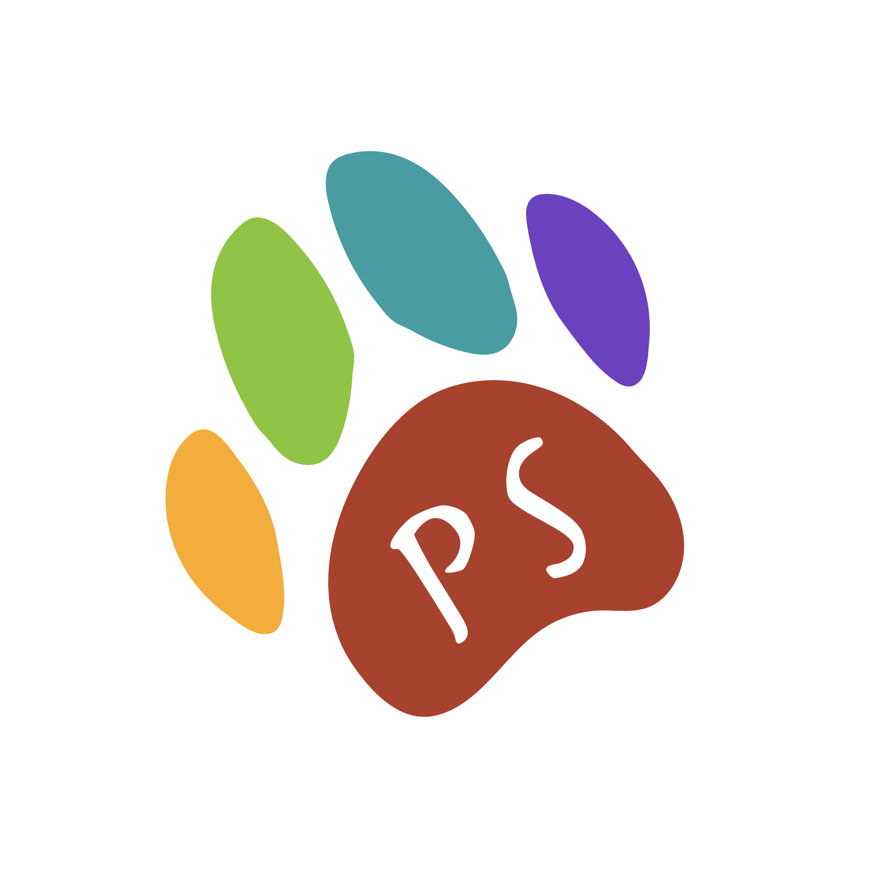

# PawvaScript



## Introduction
PawvaScript is a functional scripting language designed for non-conventional programmers such as designers, animators, and anyone who wants to make beautiful web pages fast. PawvaScript draws on many fundamentals from JavaScript, while adding aspects of Python such as indentation and readability. Our language is focused on extensive functionality while maintaining readability.

## Example Programs
```
func toDogAge uses [] and returns [number]:
    var age is prompt “How old are you?”
    return age * 7 
```

```
func createDog uses [given_name, given_humanAge, given_color] and returns [Dog]
    Dog is [name: given_name, humanAge: given_humanAge, dogAge: given_humanAge * 7]
    Dog’s color is given_color
    return Dog
```
